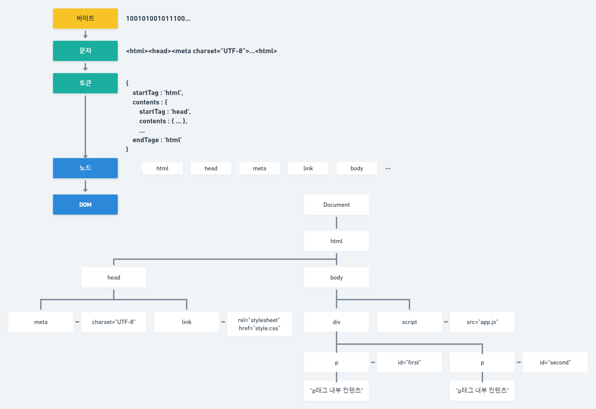
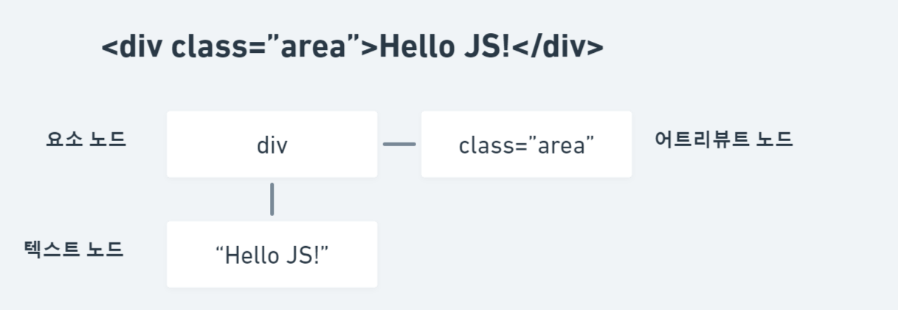

# Virtual DOM (가상 돔)

## DOM(Document Object Model)
브라우저 렌더링 엔진은 HTML 문서를 파싱하여 브라우저가 이해할 수 있는 자료 구조인 DOM을 생성한다.

HTML 문서를 파싱한 결과물로서 생성 된 DOM은 HTML 문서의 구조와 정보뿐만 아니라 HTML 요소와 스타일 등을 변경할 수 있는 프로그래밍 인터페이스로서 DOM API를 제공한다. 자바스크립트에서 DOM API를 사용하면 이미 생성 된 DOM을 동적으로 조작할 수 있다.

## 노드 (node)

HTML 요소는 렌더링 엔진에 의해 파싱되어 DOM을 구성하는 요소 노드 객체로 변환된다. 이때 HTML 요소의 어트리뷰트는 어트리뷰트 노드로,
HTML 요소의 텍스트 콘텐츠는 텍스트 노드로 변환 된다.

HTML 요소 간에는 중첩 관계에 의해 계층적인 부자 관계가 형성 된다.
이러한 HTML 요소 간의 부자 관계를 반영하여 HTML 문서의 구성 요소인 HTML 요소를 객체화한 모든 노드 객체들을 트리 자료 구조로 구성한다.
노드 객체들로 구성 된 트리 자료 구조를 DOM(Document Object Model)이라 한다. 이에 DOM 트리라는 명칭을 쓰기도 한다.

## React
사용자 인터페이스를 만들기 위한 JavaScript 라이브러리이다.
**가장 큰 강점은 Virtual DOM을 사용하여 실제 DOM 업데이트의 성능 비용을 줄인다는 점이다.**

## DOM에 변경사항이 생기면?
- DOM 객체는 트리 데이터 구조로 되어 있으며 DOM에 대한 변경은 JavaScript 엔진에서 빠르게 수행 된다. 
- 하지만 DOM 변경 후 업데이트 된 요소와 해당 자식을 다시 렌더링하여 화면을 업데이트 해야한다.
- 이 때 `CSSOM`과 상태를 비교하여 `렌더 트리`를 구성하고 레이아웃을 재설정(`리플로우`)하고 다시 칠하는 과정(`리페인트`)인 `렌더링`에 시간이 든다.
- 이를 해결하기 위해 DOM을 최소한으로 조작하여 작업을 처리하는 방식인 `Virtual DOM`의 개념이 나타났다.

## 가상 돔이란?
- React에는 모든 DOM 개체에 대해 해당하는 가상 DOM 개체가 있다. 
- 가상 DOM 객체는 DOM 객체의 경량 복사본과 같다. 
- 가상 DOM은 가상의 UI 표현이 메모리에 유지되고 ReactDOM과 같은 라이브러리에 의해 실제 DOM과 동기화되는 프로그래밍 개념이다.

## 가상 돔을 사용하면?
- 새로운 요소가 화면에 추가되면 트리로 표현되는 가상 DOM이 생성된다. 
- 이러한 요소의 상태가 변경되면 새 가상 DOM 트리가 생성된다.
- 그런 다음 이 트리는 이전 가상 DOM 트리와 diff 알고리즘을 통해 비교된다. 
- 가상 DOM은 실제 DOM에 이러한 변경을 수행할 수 있는 최상의 방법을 계산한다.
- 실제 DOM에서는 최소한의 작업이 수행되어 실제 DOM 업데이트의 성능 비용을 줄인다.
